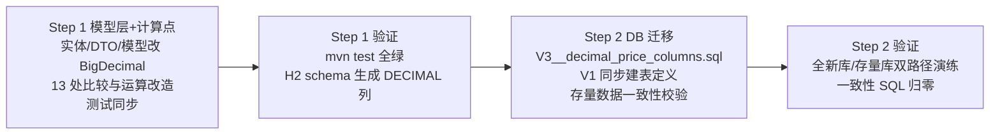
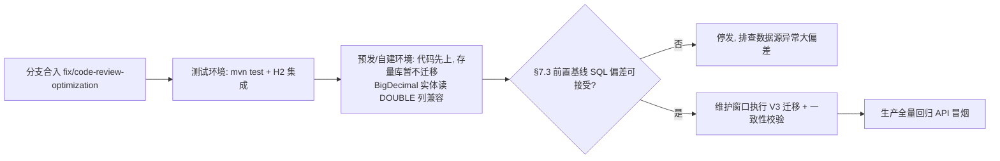

# P2-6 专项实施方案：价格字段全 Double → DECIMAL

> 依据：`docs/optimization-plan.md` §P2-6；本文档所有 文件:行号 均于 2026-08-06 对照当前分支 `fix/code-review-optimization`（HEAD `538e65a`）实际源码逐一核对。
>
> 约束（与 optimization-plan.md §0.2 一致）：tiger openapi-java-sdk **2.2.6**、mysql-connector-j **8.0.33** 禁止升级；本次为纯方案文档，**不包含任何开发动作**。
>
> 与 optimization-plan.md §P2-6 的差异勘误：原方案将 `PatternEvaluateServiceImpl` 列为 changePercent 计算点，**实际核对后该类的全部逻辑仅消费 `long[]` 成交量序列（`PatternEvaluateServiceImpl.java:33-99`），不含任何价格字段运算，无需改动**。本文档以实际代码为准。

---

## 0. 结论摘要

- **目标**：`stock_daily_bar`、`screening_match` 两张表的 9 个价格列由 `DOUBLE` 改为 `DECIMAL(12,4)`；实体/DTO/模型层 8 个类的 28 个价格字段由 `Double/double` 改为 `BigDecimal`；约 12 处比较/计算点改为 `BigDecimal` 运算。
- **精度结论**：统一采用 **`DECIMAL(12,4)`**（8 位整数 + 4 位小数，上限 99,999,999.9999）。论证见 §3。
- **落地方式**：两步走（§4 Step 1 模型层+计算点 → §5 Step 2 数据库迁移），代码先行、迁移随后，全部变更在同一分支 `fix/code-review-optimization` 内分批提交。
- **工作量**：Step 1 约 2 人日，Step 2 约 1 人日，合计 **3 人日**（±0.5），与 optimization-plan.md 的 2–3 人日估计一致。
- **本方案未执行任何开发动作**（未创建/切换分支、未改源码/测试/配置/依赖、未运行构建与测试、未推送远端）。

---

## 1. 影响面全量清单

### 1.1 实体（2 个类，9 个字段）——价格字段即 DB 列

| 文件:行号 | 字段 | 当前类型 | 可空 | 对应列 |
|---|---|---|---|---|
| `entity/StockDailyBar.java:55` | `openPrice` | `Double` | 否 | `open_price` |
| `entity/StockDailyBar.java:58` | `highPrice` | `Double` | 否（实体）/DB NULL | `high_price` |
| `entity/StockDailyBar.java:61` | `lowPrice` | `Double` | 否（实体）/DB NULL | `low_price` |
| `entity/StockDailyBar.java:64` | `closePrice` | `Double` | 否 | `close_price` |
| `entity/StockDailyBar.java:67` | `changePercent` | `Double` | 是 | `change_percent` |
| `entity/StockDailyBar.java:70` | `afterHours` | `Double` | 是 | `after_hours` |
| `entity/StockDailyBar.java:73` | `afterHoursChangePercent` | `Double` | 是 | `after_hours_change_percent` |
| `entity/ScreeningMatch.java:54` | `lastClose` | `Double` | 是 | `last_close` |
| `entity/ScreeningMatch.java:60` | `price` | `Double` | 是 | `price` |

> 注：`StockDailyBar` 实体 `highPrice/lowPrice` 标注 `nullable = false`，但 `V1__baseline.sql` 对应列实际为 `NULL`（对拍生产库结论），迁移时保持 DB 现状，仅改类型不改可空性。

### 1.2 模型层（3 个类，17 个字段）——数据源侧瞬时载体

| 文件:行号 | 字段 | 当前类型 | 说明 |
|---|---|---|---|
| `model/KLineData.java:17` | `open` | `double` | 最新一根的摘要值 |
| `model/KLineData.java:18` | `high` | `double` | 同上 |
| `model/KLineData.java:19` | `low` | `double` | 同上 |
| `model/KLineData.java:20` | `close` | `double` | 同上 |
| `model/KLineData.java:22` | `amount` | `double` | **不落库、不展示**，仅测试/日志使用 |
| `model/KLineIterator.java:11-19` | `open/high/low/close/amount/changePercent/afterHours/afterHoursChangePercent` | `double` | 8 字段；11 参构造器 `:27-44`，getter/setter `:86-156` |
| `model/StockInfo.java:15-19` | `currentPrice/openPrice/change/changePercent` | `double` | 4 字段；仅数据源内部瞬时载体（yfinance/twelvedata/tiger），**不落库** |

> `KLineIterator.amount` 与 `KLineData.amount`（成交额）不参与持久化与前端展示，**建议保持 `double` 不动**，缩小影响面（§4.4 有明确结论）。

### 1.3 DTO（5 个类）

| 文件:行号 | 字段 | 说明 |
|---|---|---|
| `enums/dto/StockDailyBarDto.java:12-18` | `openPrice/highPrice/lowPrice/closePrice/changePercent/afterHours/afterHoursChangePercent`（8 个 `Double`） | `/api/bars/single/query`、`/pages/query` 响应 |
| `enums/dto/StockDailyBarCandleDto.java:5-10` | `open/high/low/close/changePercent/afterHours/afterHoursChangePercent`（7 个 `Double`） | `/api/bars/{symbol}/candles` 响应 |
| `enums/dto/TigerWatchlistRowDto.java:8-13` | `lastPrice`(`@JsonAlias("closePrice")`)/`openPrice/highPrice/lowPrice/changePercent/afterHours/afterHoursChangePercent`（7 个 `Double`） | 截图录入入参（REST 与 `mcp/StockInvestMcpTools.java:53` 共用） |
| `enums/dto/ScreeningResultDto.java:7` | `price` | **全仓无调用方**（grep 仅声明处），随迁移一并改或删除 |
| `enums/dto/ScreeningMatchProjection.java:11,16` | `getPrice()/getLastClose()` | 接口投影，**全仓无调用方**，同上 |

### 1.4 DB 列（2 表 9 列，均 `DOUBLE`）

来源 `src/main/resources/db/migration/V1__baseline.sql`（2026-08-06 对拍生产库结构）：

| 表 | 列 | 当前定义 |
|---|---|---|
| `stock_daily_bar` | `open_price` | `DOUBLE NOT NULL` |
| `stock_daily_bar` | `high_price` | `DOUBLE NULL` |
| `stock_daily_bar` | `low_price` | `DOUBLE NULL` |
| `stock_daily_bar` | `close_price` | `DOUBLE NOT NULL` |
| `stock_daily_bar` | `change_percent` | `DOUBLE NULL` |
| `stock_daily_bar` | `after_hours` | `DOUBLE NULL` |
| `stock_daily_bar` | `after_hours_change_percent` | `DOUBLE NULL` |
| `screening_match` | `last_close` | `DOUBLE NULL` |
| `screening_match` | `price` | `DOUBLE NULL`（含索引 `idx_screening_match_trade_date_price (trade_date, price)`） |

测试环境（H2）：`application-test.yml` 中 Flyway **关闭**（`flyway.enabled: false`），H2 schema 由 `ddl-auto: create-drop` 依据实体自动生成——因此 Step 1 实体改 `BigDecimal` 后，测试库列类型自动变为 DECIMAL，无需迁移脚本（§5.4）。

### 1.5 计算点 / 比较点（Java，共 13 处）

| 文件:行号 | 位置 | 现状 | 改造 |
|---|---|---|---|
| `DataGapFillerServiceImpl.java:228` | `latest.getClosePrice() > gapFillProperties.getMinPriceThreshold()` | Double 比较 | `compareTo(BigDecimal.valueOf(minPriceThreshold)) > 0` |
| `DataGapFillerServiceImpl.java:395` | `item.getOpen() == 0.0 && item.getClose() == 0.0` 零价占位跳过 | double 比较 | `BigDecimal.ZERO.compareTo(...) == 0` 双值判断 |
| `DataGapFillerServiceImpl.java:510-517` | `persist()`：`item.getOpen()` → `bar.setOpenPrice(...)` 等 8 项 | double→Double 直赋 | `BigDecimal.valueOf(item.getOpen())`（8 处） |
| `DataGapFillerServiceImpl.java:544-549` | `afterHoursChangePercent = (ahClose - regClose) / regClose * 100` | double 算术 | BigDecimal 运算：`(ah.subtract(reg)).divide(reg, 8, HALF_UP).multiply(100).setScale(4, HALF_UP)`；`regClose` 为 null/0 分支不变 |
| `ScreeningServiceImpl.java:311` | `Math.round(close * 1000.0) / 1000.0`（lastClose 四舍五入） | double 运算 | `close.setScale(3, RoundingMode.HALF_UP)`（展示层） |
| `ScreeningServiceImpl.java:343` | `item.put("lastClose", m.getLastClose())` | Double 直放 | 透传 BigDecimal（Jackson 序列化见 §6.1） |
| `ScreeningServiceImpl.java:361` | `row.setRise(latest.getClosePrice() > latest.getOpenPrice())` | Double 比较 | `compareTo > 0` |
| `TigerStockServiceImpl.java:264-278` | `getStockInfo()`：`change = latest.getClose() - prevClose`；`changePercent = (latest.getClose() - prevClose) / prevClose * 100` | double 算术 | BigDecimal 运算（divide scale 8，HALF_UP），`prevClose == 0` 分支保留 |
| `TiingoDataSourceStrategy.java:108-121` | `getStockInfo()`：同上（`latest.getClose()`/`prev.getClose()`） | double 算术 | 同上 |
| `TigerWatchlistIngestServiceImpl.java:97-103` | `row.lastPrice() == null \|\| row.lastPrice() <= 0D`、`row.openPrice() <= 0D` 校验 | Double 比较 | `compareTo(BigDecimal.ZERO) <= 0` |
| `TigerWatchlistIngestServiceImpl.java:108-111` | `bar.setClosePrice(px)`（`double px = row.lastPrice()`）、open/high/low 回退 `px` | double 直赋 | 全部改 `BigDecimal` 直赋，删除 `double px` 中间变量 |
| `TiingoRestClient.java:51-64` | `listUsSymbolsByPriceRange`：`price >= minPrice && price <= maxPrice` | Double 比较 | `compareTo`；`resolvePrice`（`:129-152`）、`parseDouble`（`:152-158`）返回 `BigDecimal.valueOf(...)` |
| `TwelveDataRestClient.java:93-113,182-196` | `fetchLastClose`（`Double.parseDouble`/`close.asDouble()`）、`parseDouble` | double 解析 | 返回 `new BigDecimal(text)` / `BigDecimal.valueOf(asDouble)`（P2-18 容错语义不变：非数字返回 0） |

### 1.6 仓库查询（JPQL 价格参数）

| 文件:行号 | 方法 | 现状 |
|---|---|---|
| `repository/StockDailyBarRepository.java:53-59` | `findDistinctSymbolsByTradeDateAndSourceAndClosePriceBetween` | `@Param("minP") double` / `maxP` |
| `repository/StockDailyBarRepository.java:62-66` | `findDistinctSymbolsByTradeDateAndClosePriceBetween` | 同上 |
| `repository/StockDailyBarRepository.java:30` | `findTopBySymbolAndTradeDateBeforeOrderByTradeDateDesc` | 声明但**无调用方**（changePercent 自动计算预留），无改动 |

改实体为 `BigDecimal` 后，JPQL 比较 `b.closePrice >= :minP` 参数类型同步改为 `BigDecimal`（Hibernate 对 DECIMAL 列 + BigDecimal 参数为原生匹配，避免隐式转换）。

### 1.7 序列化 / 反序列化点

- **入站**：Jackson 将 Python 脚本输出 JSON 反序列化为 `KLineData/KLineIterator`——`TwelveDataStockServiceImpl.java:105`、`YFinanceStockServiceImpl.java:229`、`TigerOpenPythonBridge.java:62`、`TiingoRestClient.java:106,133`、`TigerOpenStockServiceImpl`。字段改 `BigDecimal` 后，Jackson 对 JSON 数字文本（如 `"150.25"`）**精确解析**为 `BigDecimal("150.25")`，无精度损失（§6.4）。
- **出站**：`StockDailyBarService.java:25-46`（`getRecentCandles` → CandleDto）、`:83-97`（`toDto`）→ `BarsController` `/single/query`、`/pages/query`、`/{symbol}/candles`。`BigDecimal` 默认序列化为 JSON number 且**保留 scale**（`152.5000`），需统一 `stripTrailingZeros`（§6.1）。
- **MCP 入参**：`TigerWatchlistRowDto`（`mcp/StockInvestMcpTools.java:53` `ingest_screen_capture`）——字段类型改 `BigDecimal` 后，Jackson 可接受 JSON 数字或字符串入参，兼容现有前端/MCP 调用。

### 1.8 Python 脚本（3 个，**无需必改**）

| 文件:行号 | 位置 | 说明 |
|---|---|---|
| `stock_info_yfinance.py:78-84,142-148,174-180` | `get_stock_info`/`get_daily_kline_range` 输出 | `float(v["open"])` 等输出 JSON 数字 |
| `stock_info_twelvedata.py:66-72,106-112,136-142` | 同上 | 同上 |
| `tigeropen_channel.py:93-112,145-165` | `bars`/`after_hours_bars` 输出 | 同上 |

Python `json.dumps` 对 float 使用最短往返 repr（如 `150.25` 输出 `"150.25"`），Java 侧 `BigDecimal` 解析即精确；**不必改脚本**。可选增强（不阻塞）：`Decimal` 定点化至 4 位小数，消除 `0.30000000000000004` 类二进制伪影入库（§6.4）。`test_script.py` 为测试脚本不参与生产。

### 1.9 配置

- `config/GapFillProperties.java:18`：`minPriceThreshold = 1.00`（`double`）。YAML 配置项可保持 `double`，在比较点（§1.5 第 1 条）`BigDecimal.valueOf()` 转换；或字段直接改 `BigDecimal`（YAML `1.00` 可被 Spring 绑定）——推荐后者，减少每处换算。

### 1.10 前端

- **本仓库无前端代码**：`src/main/resources` 下仅 `static/favicon.svg`、`python/`、配置与迁移脚本（glob 全仓确认无 html/js/css/ts）。[INFERENCE] 前端为仓库外独立工程，经 `/api/bars`、`/api/screening`、`/api/admin` 的 JSON 消费价格。
- 展示字段：`open/high/low/close/changePercent/afterHours/afterHoursChangePercent`（candles）、`lastClose`（screening）、`closePrice/openPrice/...`（bars 分页）。
- 兼容性：JSON 数字经 JS `Number()` 解析，`152.5000` → `152.5`，**前端展示不受影响**；若前端有 JSON 字符串相等断言/快照对比则需回归（§6.1）。

### 1.11 测试影响面（13 个测试文件断言 Double 值）

| 文件 | 断言点 |
|---|---|
| `entity/StockDailyBarFieldTest.java:98-104` | `assertEquals(150.0, bar.getOpenPrice(), 0.001)` 等 7 处 |
| `model/KLineIteratorFieldTest.java:33-37` | 同上风格 |
| `model/KLineIteratorTest.java:76-129` | `setClose/getClose/...` 0.001 断言 |
| `enums/dto/StockDailyBarCandleDtoTest.java` | DTO-001~005 全部数值断言 |
| `service/DataGapFillerPersistTest.java:133-139,196-199` | persist 结果断言 |
| `service/DataGapFillerAfterHoursTest.java:223-225,246` | afterHours/changePercent 断言 |
| `client/TiingoRestClientCandleTest.java:72-73,94,118`、`TiingoRestClientAuthTest.java:156` | `getClose()` 断言 |
| `client/TwelveDataRestClientCandleTest.java:72-73,115`、`TwelveDataRestClientAuthTest.java:127` | 同上 |
| `client/ExtraCoverageTests.java:47` | `fetchLastClose` 断言 |
| `datasource/TiingoStockInfoTest.java:70-74` | StockInfo 断言 |
| `service/TigerAfterHoursTest.java:78`、`TigerStockServiceKlineTest.java:58-114` | KLine 转换断言 |
| `service/StockDailyBarServiceTest.java:178-182` | 测试数据构造 helper（`double open...` 参数） |
| `scheduler/DataGapFillerIntegrationTest.java:68-72,101-106` | 真实库 changePercent 一致性校验（`Math.round((curr-close - prev-close)/prev-close*100*10000)/10000`） |
| `controller/BarsControllerIntegrationTest.java:102-113` | API changePercent vs DB 比对（`(Double) candle.get(...)` 反序列化后仍为 Double，可兼容） |
| `service/ScreeningServiceTest.java` | **无价格断言**（grep 确认），无需改 |

---

## 2. 两步落地计划总览



- **Step 1（代码先行）**：改类型不改库。BigDecimal 实体读写 DOUBLE 列由 Hibernate 兼容（`getBigDecimal` 按 `BigDecimal.valueOf(double)` 语义读取），**可单独上线**，作为 Step 2 前的灰度。
- **Step 2（库随其后）**：Flyway `V3` 迁移改列；`V1__baseline.sql` 同步建表定义（仅影响全新环境）；存量数据校验。
- 两步**必须同版本发布间隔内完成**（建议同一 release，先代码后迁移），避免长期 Double 列 + BigDecimal 实体混跑（无正确性问题，但失去精度收益）。

---

## 3. DECIMAL 精度论证与选择

### 3.1 精度需求

| 数据 | 量级 | 说明 |
|---|---|---|
| 美股价格 | $0.0001 ~ $700,000+ | 低价股可至 0.0001 级（部分 OTC），高价股 BRK.A ≈ $7×10^5 |
| 涨跌幅 `changePercent` | 常规 -100% ~ +1000%（极端妖股） | 百分比数值 |
| 盘后价/盘后涨跌幅 | 同上 | 同上 |

### 3.2 结论：`DECIMAL(12,4)`（全价格列统一）

- **8 位整数**：上限 99,999,999.9999，覆盖美股最高价（含 BRK.A 级）两个数量级余量；
- **4 位小数**：价格精度 0.0001，覆盖所有现实价格粒度（交易所最小 tick 为 0.0001）；涨跌幅列同精度，百分比场景 4dp 足够（内部运算用更高 scale，仅存储圆整至 4dp）；
- **存储开销**：12 位十进制 ≈ 6 字节（MySQL DECIMAL 每 9 位 4 字节），相比 DOUBLE 8 字节**反而更省**；索引 `idx_screening_match_trade_date_price`、`uk_stock_daily_bar_symbol_trade_date` 不受影响；
- **备选方案**：价格列 `DECIMAL(12,4)`、百分比列 `DECIMAL(10,4)` 分别定制——收益有限（仅省 1 字节），**不推荐**，统一 `DECIMAL(12,4)` 降低心智负担与迁移脚本复杂度。

### 3.3 存量数据转换语义（DOUBLE → DECIMAL）

- MySQL `ALTER TABLE ... MODIFY COLUMN ... DECIMAL(12,4)` 对存量值按 **四舍五入（银行家舍入语义由 MySQL 实现，实际为 HALF_UP 风格）** 圆整至 4 位小数；
- DOUBLE 二进制伪影（如 `0.1` 实际存 `0.1000000000000000055511...`）在转换时收敛为 `0.1000`——**方向正确，即本次改造的目的**；
- 迁移前需量化舍入影响：`SELECT COUNT(*), MAX(ABS(close_price - ROUND(close_price,4))) FROM stock_daily_bar`（§7.3 校验 SQL 完整给出）；
- Java 侧读取 DOUBLE 列时 Hibernate 用 `BigDecimal.valueOf(double)`（`Double.toString` 语义），与迁移后 DECIMAL 值在 4dp 内一致。

### 3.4 转换点统一规则

- **数据源入站（double → BigDecimal）**：`BigDecimal.valueOf(double)`——保证现有 double 值（`Double.toString` 最短往返）的精确十进制表示，禁止 `new BigDecimal(double)`（会产生 `0.1000000000000000055...` 长尾）；
- **JSON 文本入站**：Jackson 直接解析为 `BigDecimal`（精确，无需 valueOf）；
- **出站展示**：`stripTrailingZeros()` 后序列化，保持 JSON 数字形态与既有 `152.5` 一致；
- **存储**：`setScale(4, RoundingMode.HALF_UP)`。

---

## 4. Step 1：模型层 + 计算点（代码先行，不涉及 DB）

### 4.1 实体与模型类型改造

1. `entity/StockDailyBar.java`：7 个 `Double` → `BigDecimal`；`@Column` 注解不变（`nullable` 语义不变）。
2. `entity/ScreeningMatch.java`：`lastClose`、`price` → `BigDecimal`。
3. `model/KLineIterator.java`：`open/high/low/close/changePercent/afterHours/afterHoursChangePercent` 7 个 `double` → `BigDecimal`；11 参构造器 `:27-44` 与 8 参构造器（`0.0` → `BigDecimal.ZERO`）同步；getter/setter 类型同步；`toString`（`:169-173`）拼接不变（BigDecimal 的 toString 即数字文本）。
4. `model/KLineData.java`：`open/high/low/close` → `BigDecimal`；`amount` **保持 `double`**（§4.4）。
5. `model/StockInfo.java`：`currentPrice/openPrice/change/changePercent` → `BigDecimal`（Tiger/Tiingo 两个 `getStockInfo` 计算点同步，§1.5）。

### 4.2 DTO 类型改造

6. `StockDailyBarDto.java`、`StockDailyBarCandleDto.java`、`TigerWatchlistRowDto.java`：价格组件 `Double` → `BigDecimal`（record 组件类型直接替换，无构造器校验影响——现无价格校验）。
7. `ScreeningResultDto.java`、`ScreeningMatchProjection.java`：`Double` → `BigDecimal`（无调用方，随迁；若确认永不用可删除，但**删除属 P3-1 清理范畴，本次仅改类型**）。

### 4.3 比较与运算点改造（13 处，见 §1.5 明细）

统一规则：

```java
// 比较：一律 compareTo，禁止 == / != / > / < / <= / >=
if (latest.getClosePrice().compareTo(gapFillProperties.minPriceThreshold()) > 0) { ... }

// 运算：中间精度用 scale 8，落库/展示圆整到 4 或 3 位
BigDecimal regClose = bar.getClosePrice();
if (regClose != null && regClose.compareTo(BigDecimal.ZERO) != 0) {
    BigDecimal pct = ahClose.subtract(regClose)
            .divide(regClose, 8, RoundingMode.HALF_UP)
            .multiply(BigDecimal.valueOf(100))
            .setScale(4, RoundingMode.HALF_UP);
    bar.setAfterHoursChangePercent(pct);
}
```

逐条要点：

- `DataGapFillerServiceImpl.java:228`：`minPriceThreshold` 改为 `BigDecimal` 字段（`GapFillProperties.java:18`，YAML `1.00` 可绑定）后直接 `compareTo`；
- `:395` 零价占位：`item.getOpen().compareTo(BigDecimal.ZERO) == 0 && item.getClose().compareTo(BigDecimal.ZERO) == 0`；
- `:510-517` persist：8 个赋值点 `bar.setXxx(item.getXxx())`——此时 `item.getXxx()` 已是 `BigDecimal`，直赋即可（Jackson 解析路径天然 BigDecimal，**无需 valueOf**）；
- `:544-549` afterHoursChangePercent：见上示例（`ahClose` 亦为 BigDecimal）；
- `ScreeningServiceImpl.java:311`：`close.setScale(3, RoundingMode.HALF_UP)` 替代 `Math.round(close*1000)/1000`（保持现有 3 位展示语义）；
- `:361` rise：`compareTo > 0`；
- `TigerStockServiceImpl.java:264-278` / `TiingoDataSourceStrategy.java:108-121`：`StockInfo` 计算改 BigDecimal（divide scale 8），`prevClose == 0` 分支改为 `compareTo(ZERO) == 0` 时 `setChangePercent(BigDecimal.ZERO)`；
- `TigerWatchlistIngestServiceImpl.java:97-103`：`lastPrice() == null || lastPrice().compareTo(BigDecimal.ZERO) <= 0`；`px` 中间变量删除，`:108-111` 直接赋值（`highPrice() != null ? row.highPrice() : row.lastPrice()`）；
- `TiingoRestClient.java`：`resolvePrice` 返回 `BigDecimal`（`p.isNumber() ? p.decimalValue() : new BigDecimal(text)`，parseDouble 处 `BigDecimal.valueOf(v.asDouble())`）；`listUsSymbolsByPriceRange` 的 `minPrice/maxPrice` 参数改 `BigDecimal`，比较改 `compareTo`；
- `TwelveDataRestClient.java:93-113`：`fetchLastClose` 返回 `BigDecimal`（`new BigDecimal(close.asText())`，非数字返回 null 的容错语义不变）；`parseDouble` 返回 `BigDecimal`（`BigDecimal.ZERO` 兜底）；
- `StockDailyBarRepository.java:53-66`：JPQL 参数 `double minPrice/maxPrice` → `BigDecimal`。

### 4.4 明确不改的范围

- `KLineData.amount` / `KLineIterator.amount`（成交额）：不落库、不出 API，仅日志与测试引用——保持 `double`；
- `StockScannerStrategy.scanStocks(Market, int, Double minPrice, Double maxPrice)` 及实现（`TigerOpenStockServiceImpl.java:139-155`、`TwelveDataStockServiceImpl.java:203-206`、`YFinanceStockServiceImpl.java:318-321`、`TiingoDataSourceStrategy.java:163-169`、`TigerStockServiceImpl.java:353-361`）：`min/max` 是**筛选器参数**（`String.valueOf` 透传 Python、Tiger SDK `BaseFilter.filterMin/filterMax` 接受 Double），非持久化价格，保持 `Double` 不动；
- `TigerOpenPythonBridge.listCandidates(int, double, double)`：价格带参数透传，不改；
- `PythonScriptExecutor`、`WatchlistVolumeParser`（已 BigDecimal）：无关；
- `PatternEvaluateServiceImpl`：仅消费 `long[]` 成交量，**无价格运算**（纠正 optimization-plan 的提法）；
- `screening_match` 索引、唯一约束：类型 DECIMAL 后 MySQL 自动适配，无 DDL 变更。

### 4.5 Step 1 测试同步

- 全部 `assertEquals(150.0, x.getClose(), 0.001)` 断言（§1.11 清单）改为 `assertEquals(0, x.getClose().compareTo(new BigDecimal("150.0")))` 或 `assertEquals(new BigDecimal("150.0"), x.getClose())`（BigDecimal equals 含 scale，需统一 `stripTrailingZeros()` 或使用 compareTo 风格断言，**推荐 compareTo + 明确 scale 的双断言**）；
- `DataGapFillerIntegrationTest.java:105-106` 的 changePercent 期望公式改为 BigDecimal 版（divide scale 8 → setScale(4)）；
- `BarsControllerIntegrationTest.java:102-113`：`(Double) candle.get("changePercent")`——API 响应经 Jackson 反序列化到 Map 时数值仍为 `Double`（默认浮点节点），**可兼容**；若改为 `BigDecimal` 期望则同步调整；
- 新增断言点：`StockDailyBarService` DTO 映射后 JSON 输出 `152.5` 而非 `152.5000`（§7.1 序列化测试）。

---

## 5. Step 2：DB 列类型 ALTER（Flyway 迁移）

### 5.1 迁移脚本草案（新文件 `src/main/resources/db/migration/V3__decimal_price_columns.sql`）

```sql
-- ============================================================
-- stock-invest V3 —— 价格列 DOUBLE → DECIMAL(12,4)（P2-6）
-- 说明：
--   * 全新库：V1 已改为 DECIMAL 建表（见 5.2），本脚本为 no-op；
--   * 存量库：MODIFY COLUMN 就地转换，MySQL 自动按 4dp 四舍五入存量值；
--   * 幂等：对已转换的库重复执行 MODIFY 无副作用；
--   * 测试环境 H2：Flyway 关闭（application-test.yml），不执行本脚本。
-- ============================================================

ALTER TABLE stock_daily_bar
    MODIFY COLUMN open_price DECIMAL(12,4) NOT NULL,
    MODIFY COLUMN high_price DECIMAL(12,4) NULL,
    MODIFY COLUMN low_price DECIMAL(12,4) NULL,
    MODIFY COLUMN close_price DECIMAL(12,4) NOT NULL,
    MODIFY COLUMN change_percent DECIMAL(12,4) NULL,
    MODIFY COLUMN after_hours DECIMAL(12,4) NULL,
    MODIFY COLUMN after_hours_change_percent DECIMAL(12,4) NULL;

ALTER TABLE screening_match
    MODIFY COLUMN last_close DECIMAL(12,4) NULL,
    MODIFY COLUMN price DECIMAL(12,4) NULL;
```

> 不引入 `ADD COLUMN IF NOT EXISTS` / information_schema 探测——本脚本只有类型修改没有增删列，`MODIFY COLUMN` 天然幂等（重复执行类型不变，MySQL 无操作）。`V2__align_existing.sql` 的条件 DDL 风格仅因历史列缺失问题需要，此处不适用。

### 5.2 `V1__baseline.sql` 同步（仅影响全新环境）

将 `stock_daily_bar` 7 列与 `screening_match` 2 列的定义由 `DOUBLE` 改为 `DECIMAL(12,4)`（可空性/注释不变）。已应用 V1 的存量库因 `flyway_schema_history` 有记录不会重跑，无影响；全新库直接建 DECIMAL 列，V3 变 no-op。

### 5.3 存量数据转换策略

1. **迁移前基线**（量化舍入影响，超出容忍则先评估）：
   ```sql
   SELECT COUNT(*) AS rows_affected,
          MAX(ABS(close_price - ROUND(close_price, 4))) AS max_rounding_delta,
          ROUND(100.0 * COUNT(*) / (SELECT COUNT(*) FROM stock_daily_bar), 3) AS pct
   FROM stock_daily_bar WHERE close_price IS NOT NULL AND close_price <> ROUND(close_price, 4);
   ```
   同样对 `open_price/high_price/low_price/change_percent/after_hours/after_hours_change_percent` 及 `screening_match.last_close/price` 执行；
2. **预期结论**：价格数据源（yfinance/twelvedata/tiingo/tiger）本身为 2 位小数报价，DOUBLE 列中 4dp 以上误差仅来自二进制浮点伪影（如 `0.1` 尾差），`max_rounding_delta` 应远小于 0.0001 量级；若出现异常大偏差（如数据源曾存过 6dp 计算值），需先核对来源再迁移；
3. **迁移执行**：维护窗口内 `flyway migrate`（或手工执行 V3），单表 `ALTER` 在数千万行级别为秒级~分钟级（MySQL 8.0 为 in-place 类型转换，非表重建）；
4. **迁移后校验**：§7.3 一致性 SQL 全零。

### 5.4 测试环境（H2）策略

- `application-test.yml` Flyway 关闭（既有决策，P2-1 偏差记录）；H2 schema 由 `ddl-auto: create-drop` 按实体生成——Step 1 实体改 `BigDecimal` 后自动得到 DECIMAL 列，**集成测试天然覆盖"DECIMAL 列 + BigDecimal 实体"组合**；
- 若未来要为 H2 启用 Flyway，需同步处理 V1/V2 的 MySQL 专有语法（与 P2-1 联动，不在本方案范围）。

---

## 6. 兼容性与回归风险分析

### 6.1 JSON 序列化格式变化（出站）

- **风险**：`BigDecimal` 默认按 `toString` 序列化并**保留 scale**——`setScale(4)` 后输出 `152.5000` 而非原 `152.5`。JS `Number("152.5000") === 152.5` 展示无碍，但会破坏：API 快照对比、文本断言、第三方精确字符串消费。
- **对策（强制）**：DTO 映射（`StockDailyBarService.toDto`/`getRecentCandles`）与 Screening 出参（`ScreeningServiceImpl.java:311,343`）统一 `stripTrailingZeros()`；更稳妥做法是全局 Jackson 序列化配置 `@JsonSerialize(using = ToStringSerializer.class)` 不适用（会变字符串），正确做法是配置 `WRITE_BIGDECIMAL_AS_PLAIN` 不足以去尾零——**推荐在映射点 stripTrailingZeros，最小侵入**；
- **入站**：JSON 数字或字符串均可被 Jackson 解析为 BigDecimal，前端/MCP 既有入参（`TigerWatchlistRowDto`）兼容。

### 6.2 前端数字展示

- 本仓库无前端（§1.10）；对外接口 JSON 数值语义不变，仅可能多尾零（6.1 已消除）。[INFERENCE] 前端需回归项：candles 图（open/high/low/close 数值）、筛选结果 `lastClose`、bars 分页、Tiger 截图录入回显——均应为纯数值展示，无格式敏感。

### 6.3 比较语义回归（最容易出错的点）

- `BigDecimal.equals` 含 scale（`new BigDecimal("1.0").equals(new BigDecimal("1.00")) == false`），**业务比较一律 `compareTo`**；
- 现有 6 处 `> / < / ==` 价格比较（§1.5）必须全部改造，遗漏任一处在编译期即暴露（double 与 BigDecimal 不可比较），**编译期兜底**是本次改造的优势；
- `changePercent` 为 null 的分支（`ScreeningServiceImpl.java:310-311` 已处理 null）保持 null 语义；负值（跌）在 compareTo 下自然正确。

### 6.4 Python 数据源精度

- 入站 JSON 文本 → BigDecimal 精确（`"150.25"` → 150.25）；Python `float()` 的二进制伪影（如 `0.1+0.2 → 0.30000000000000004`）会原样入库，仅影响极端计算场景，当前数据源报价均为 2dp 文本，实际不触发；
- **可选增强（不阻塞）**：Python 侧输出前 `round(float, 4)` 或 `Decimal(str(x)).quantize(Decimal("0.0001"))`，作为 M3 期 P2-15/16 批次一并处理，本方案不强依赖。

### 6.5 边界值

| 边界 | 现状 | 迁移后行为 |
|---|---|---|
| `null`（changePercent/afterHours/afterHoursChangePercent/lastClose/price 可空） | null 直通 | BigDecimal 保持 null，`compareTo` 前需判空（现有代码已判，注意新增比较点同样判） |
| `0`（零价占位 `:395`、`prevClose == 0` 除零保护） | `== 0.0` / `!= 0D` | `compareTo(ZERO) == 0`，除零保护语义不变 |
| 负值（changePercent 跌） | 正常 | 正常 |
| 大值（BRK.A ~ $7×10^5） | DOUBLE 无损 | DECIMAL(12,4) 无溢出，4dp 圆整 |

### 6.6 与既有修复的联动

- **P1-3 三态判定**（`isNotFoundError`、`StockDataException.classify`）：只处理错误消息关键词，与价格类型无关，无冲突；
- **P1-2 事务/互斥**：persist（`DataGapFillerServiceImpl.java:520`）与 afterHours 合并（`:550`）的 `runInTx` 保存点类型变化不影响事务语义；
- **P2-5 唯一约束**（screening_match）：与列类型无关；
- **依赖冻结**：`ALTER ... MODIFY COLUMN ... DECIMAL` 为 MySQL 8.0.33 原生支持，不依赖新驱动特性；mysql-connector-j 8.0.33 对 DECIMAL 的 JDBC 类型映射（`DECIMAL` → `BigDecimal`）无需升级。

---

## 7. 测试方案

### 7.1 单元测试（Step 1 随代码）

| 测试 | 断言 |
|---|---|
| `DataGapFillerPersistTest` 改造 | persist 后 `openPrice/closePrice/changePercent/afterHours...` 为 `BigDecimal("150.0")` 等精确值，scale 为 4 |
| `DataGapFillerAfterHoursTest` 改造 | `afterHoursChangePercent = (157-152.5)/152.5*100` BigDecimal 运算结果 `2.9508`（scale 4） |
| `ScreeningServiceImpl` 单测（若有） | rise 判定、lastClose 3 位圆整输出 |
| `TiingoRestClientCandleTest`/`TwelveDataRestClientCandleTest` 改造 | `getClose()` 返回 BigDecimal 精确值；`fetchLastClose` 非数字容错返回 null/0 语义不变 |
| 新增 `BigDecimalSerializationTest` | `StockDailyBarDto`/CandleDto 映射后 `stripTrailingZeros`：`152.5000 → 152.5` 输出 |
| `TigerStockServiceKlineTest` 改造 | SDK `KlinePoint.getClose()` double → `BigDecimal.valueOf` 转换断言 |
| `TiingoStockInfoTest` 改造 | `changePercent = (151-149)/149*100` BigDecimal 运算断言（当前注释即该期望） |

### 7.2 集成测试（H2，Step 1 后自动覆盖）

- 现有 `StockDailyBarServiceTest`、`BarsControllerIntegrationTest`、`DataGapFillerIntegrationTest` 跑通即证明：H2（`ddl-auto=create-drop`）依据实体生成 **DECIMAL 列**，全链路（入库 → 查询 → DTO → JSON）在 DECIMAL 列上工作；
- `DataGapFillerIntegrationTest.java:101-106` 的 changePercent 期望公式同步为 BigDecimal 版（保留"相邻交易日涨跌幅一致"的业务断言）。

### 7.3 真实库迁移验证（Step 2，手工/脚本）

1. **全新环境演练**：空库启动 → Flyway V1（DECIMAL 建表）→ V2 → V3（no-op）→ 检查 `information_schema.COLUMNS` 列类型全为 `decimal(12,4)`；
2. **存量库演练**：生产结构 dump（不含数据）→ 灌入样本数据 → 执行 §5.3 前置基线 SQL → `flyway migrate`（V1 幂等跳过、V2 对齐、V3 转类型）→ 校验：
   ```sql
   -- 迁移后：任何列都不应再出现与 4dp 圆整值的差异（应返回 0 行）
   SELECT COUNT(*) FROM stock_daily_bar
   WHERE close_price <> ROUND(close_price, 4)
      OR open_price  <> ROUND(open_price,  4)
      OR high_price  <> ROUND(high_price,  4)
      OR low_price   <> ROUND(low_price,   4);
   -- screening_match 同法
   ```
3. **前后一致性对比**（迁移前后各取一次，抽样 100 行）：
   ```sql
   -- 迁移前导出: SELECT symbol, trade_date, CAST(close_price AS DECIMAL(12,4)) AS c FROM stock_daily_bar ORDER BY id LIMIT 100;
   -- 迁移后导入对比: 两结果集 DIFF 应为空（4dp 圆整值不变）
   ```
4. **应用层回归**：启动应用连存量库 → 跑 `GET /api/bars/{symbol}/candles`、`/api/bars/pages/query`、`/api/screening/latest` → 数值正常、无 500；
5. **性能抽查**：`idx_screening_match_trade_date_price` 与 `uk_stock_daily_bar_symbol_trade_date` 查询计划仍走索引（EXPLAIN 检查）。

### 7.4 全量回归

- `mvn test` 全绿（Step 1 完成后即可跑，Step 2 为纯 SQL 不影响单测）；
- 重点回归包：`client/*`（Tiingo/TwelveData 解析）、`service/*`（DataGapFiller/Screening/StockDailyBar/Tiger）、`controller/*`（BarsControllerIntegrationTest）。

---

## 8. 回滚方案与灰度策略

### 8.1 灰度策略



- **代码先行**（Step 1 单独可上线）：BigDecimal 实体 + DOUBLE 列由 Hibernate 兼容（读侧 `BigDecimal.valueOf(double)` 语义，写侧 JDBC 自动转换），无功能回归；此窗口内精度收益未生效，但保证 Step 2 可随时独立执行；
- **迁移窗口**：V3 为 in-place 类型转换，建议选在补缺调度（19:00）与筛选（21:30）之外的时段，避免 DDL 与长事务锁竞争（MySQL 8.0 在线 DDL 该操作无需锁表重写，但稳妥起见避开任务时段）。

### 8.2 回滚方案

| 阶段 | 回滚动作 | 代价 |
|---|---|---|
| Step 1 已上、Step 2 未执行 | `git revert` Step 1 提交（或分支整体回退） | 无数据风险（DB 未动） |
| Step 1+2 均已执行 | 1) 新增 `V4__revert_decimal_to_double.sql`（`MODIFY COLUMN ... DOUBLE` 还原 9 列）；2) 回滚代码；3) 前端无改动 | **数据已圆整至 4dp**，回滚后 DOUBLE 列存 4dp 圆整值——与迁移前相比消除了浮点伪影，**不会比迁移前更差**；长期精度收益丢失但无损失 |

> 回滚说明：DECIMAL(12,4) → DOUBLE 是"有损"方向（8dp 以上精度本不存在于 4dp 列中），实际无损于已存数据；不提供"恢复二进制伪影"的逆操作（无意义）。

---

## 9. 工作量与排期

| 步骤 | 内容 | 工作量 | 依赖 |
|---|---|---|---|
| Step 1a | 实体/模型/DTO 类型改造（8 类） | 0.5 人日 | 无 |
| Step 1b | 13 处计算/比较点 + 2 条 JPQL 参数 + GapFillProperties | 0.5–1 人日 | 1a |
| Step 1c | 测试同步（§1.11 清单 + 新增序列化测试） | 0.5 人日 | 1a/1b |
| **Step 1 合计** | | **1.5–2 人日** | 完成后可单独合入 |
| Step 2a | V3 迁移脚本 + V1 同步（§5.1/5.2） | 0.25 人日 | Step 1 |
| Step 2b | 存量库演练 + 一致性校验 + API 冒烟回归 | 0.5–0.75 人日 | 2a |
| **Step 2 合计** | | **0.75–1 人日** | 维护窗口执行 |
| **总计** | | **2.5–3 人日** | 与 optimization-plan.md P2-6（2–3 人日）一致 |

**建议排期**：并入 M3 批次（optimization-plan.md §4 路线图 M3「后续」），独立分支合入避免与 M1/M2 混批（optimization-plan.md §5 风险第 4 条）；Step 1 与 Step 2 之间间隔不超过一个发布周期。

---

## 10. 未执行的开发动作确认

- ✅ 未创建/切换任何 git 分支（当前仍在 `fix/code-review-optimization`，HEAD `538e65a`，工作区无新增改动）；
- ✅ 未修改任何源码、测试、配置、依赖；
- ✅ 未运行构建/测试/Flyway；
- ✅ 未修改 `docs/optimization-plan.md` 与 `docs/test-plan.md`；
- ✅ 未推送远端；
- ✅ 依赖保持冻结：tiger openapi-java-sdk 2.2.6、mysql-connector-j 8.0.33。
